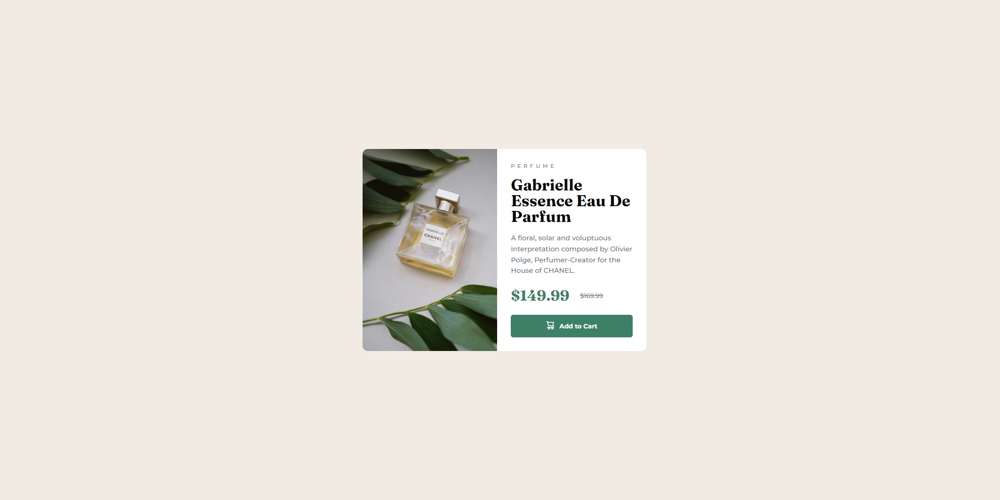

# Frontend Mentor - Product preview card component solution
https://www.frontendmentor.io/challenges/product-preview-card-component-GO7UmttRfa.

## Table of contents


- [The challenge](#the-challenge)
- [Screenshot](#screenshot)
- [Links](#links)
- [Built with](#built-with)
- [What I learned](#what-i-learned)
- [Author](#author)

### The challenge

Users should be able to:

- View the optimal layout depending on their device's screen size
- See hover and focus states for interactive elements

### Screenshot



### Links

- Solution URL: 
- Live Site URL: https://danieldeaconescu.github.io/product_preview_card/


### Built with

- Semantic HTML5 markup
- CSS custom properties
- Flexbox
- Mobile-first workflow

### What I learned

This is my firt attempt at using the BEM (Block-Element-Modifier) CSS naming convention. 

```html
<div class="card">
      <div class="card__image"></div>
      <div class="card__info">
        <p class="card__info--description">Perfume</p>
        <h1 class="card__info--title">Gabrielle Essence Eau De Parfum</h1>
        <p class="card__info--paragraph">
          A floral, solar and voluptuous interpretation composed by Olivier
          Polge, Perfumer-Creator for the House of CHANEL.
        </p>
        <div class="card__info__price">
          <p class="card__info__price--main">$149.99</p>
          <p class="card__info__price--old">$169.99</p>
        </div>
        <div class="card__info__cart">
          <a href="#" class="card__info__link">
            <span class="cart__info__link--img">
              
            </span>
            Add to Cart
          </a>
        </div>
      </div>
    </div>
```
## Author

- Frontend Mentor - @DanielDeaconescu(https://www.frontendmentor.io/profile/DanielDeaconescu)
